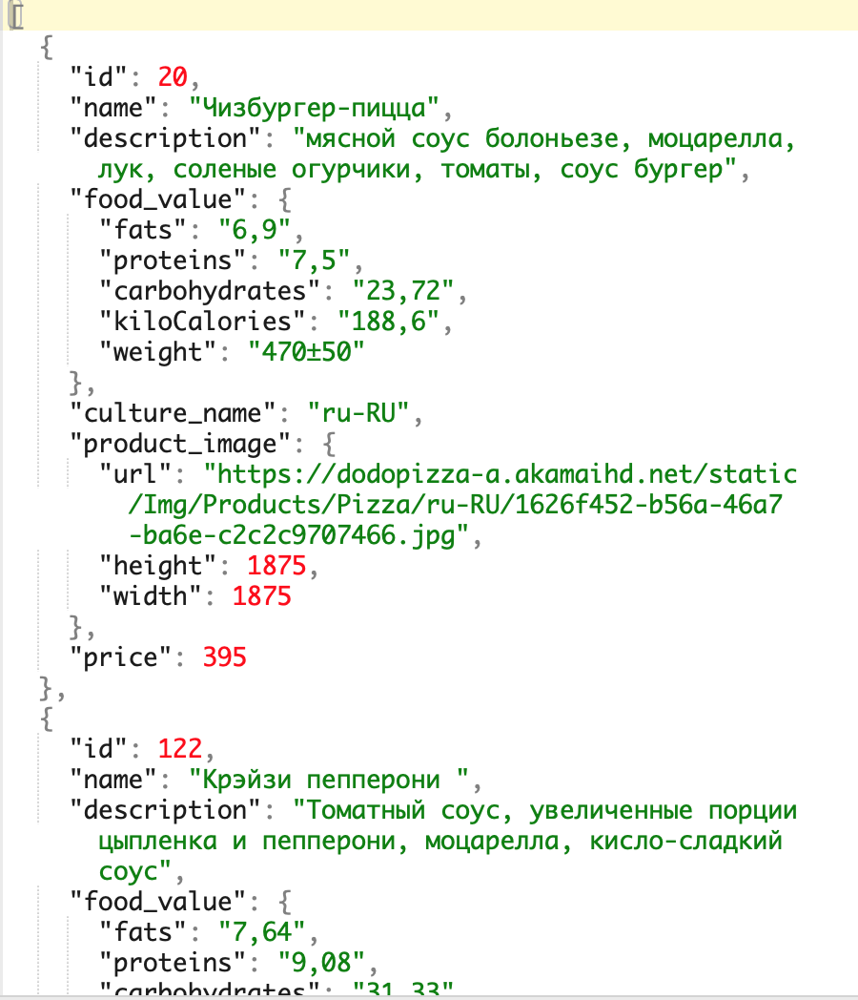
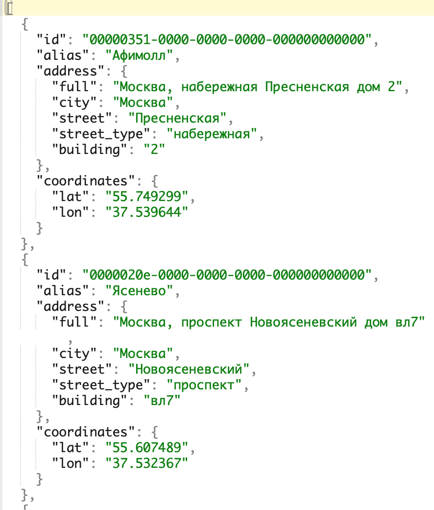

# Магазин доставки в Телеграмме

Бот умеет продавать товары в telegram. В качестве примера реализована доставка пиццы. Бот интегрирован с CMS [Moltin](https://www.moltin.com/). Так же бот использует базу данных на [Redislabs](https://redislabs.com). В боте можно выбрать несколько товаров, они сложатся в корзину покупок. Когда клиент решит, что готов к оплате, его попросят дать контактный телефон. Затем указать адрес доставки или геопозицию, либо выбрать самовывоз. При доставки бот информирует курьера куда доставлять заказ. Перед оплатой заказа бот предложить выбрать вид оплаты, и если выбран вид "по карте", то бот проведет платеж. Так же реализовано напоминание покупателю через один час, о доставке пиццы.

 
------------------------------- 

## Установка и запуск

Python3 должен быть уже установлен. Затем используйте pip (или pip3, если есть конфликт с Python2) для установки зависимостей:

```
pip install -r requirements.txt
```

Создайте базу данных на [Redislabs](https://redislabs.com).
Создайте новый магазин в [Moltin](https://dashboard.elasticpath.com/stores).

Для установки создайте файл .env, в котором заполните следующие переменные окружения:
- `TG_ACCESS_TOKEN` - Секретный ключ бота telegram для магазина.
- `TG_LOG_TOKEN` - Секретный ключ бота для информации об ошибках.
- `TG_CHAT_ID` - ID чата текущего пользователя telegram.
- `MOLTIN_CLIENT_SECRET` - Секретный токен магазина в CMS [Moltin](https://www.moltin.com/).
- `MOLTIN_CLIENT_ID` - Client ID магазина в CMS [Moltin](https://www.moltin.com/).
- `REDIS_HOST` - Адрес базы данных redis.
- `REDIS_PORT` - Порт для подключения к базе данных redis.
- `REDIS_PASSWORD` - Пароль для подключения к базе данных redis.
- `YANDEX_API_KEY` - API ключ [yandex геокодер](https://developer.tech.yandex.ru/services/).
- `PAYMENT_TOKEN` - Токен провайдера платежей.

В CMS Moltin должны быть созданы модели и поля, а также загружена информация о продуктах и адресах. Скрипт motlin_load.py делает это автоматически. 
Для загрузки необходимы json файлы следующих форматов:
|
--------------------------|-----------------------------

Запускают скрипт со следующими параметрами:
1. `-m, --models`      Путь к *.json файлу с описанием моделей.
2. `-p, --products`    Путь к *.json файлу с продуктами.
3. `-a, --address`     Путь к *.json файлу с адресами.
```
python.exe motlin_load.py -m models.json -p menu.json -a addresses.json
```	
Файл `models.json` присутствует в составе скрипта.


Основной скрипт бота запускают без параметров:

```
python.exe tg_bot.py
```	

Информацию о ходе выполнения скрипт отправляют отдельному боту telegram. Токен его должен быть указан в соответствующей переменной окружения.
В составе скрипта присутствует файл `Procfile`, необходимый для деплоя на сервер [HEROKU](https://heroku.com). Файл уже настроен должным образом, поэтому перенос скрипта на сервер выполняется в соответствии с документацией сервера [HEROKU](https://devcenter.heroku.com/articles/git).


## Цель проекта

Код написан в образовательных целях, для изучения возможностей чат-ботов, на онлайн-курсе для веб-разработчиков [dvmn.org](https://dvmn.org).
